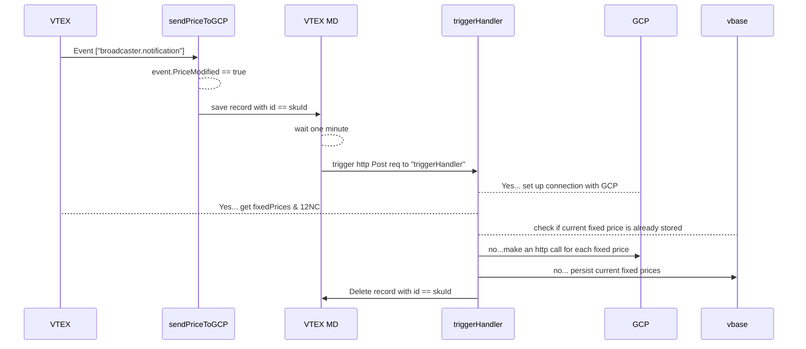

# Welcome in payment-provider-handler!

## What am I used for?

 [Receiving Catalog Changes on VTEX IO](https://developers.vtex.com/docs/guides/how-to-receive-catalog-changes-on-vtex-io)
In order to accomplish its duty it looks for the events:  ["broadcaster.notification"] . When this kind of event is intercepted it will call the two middlewares [**getAppSettings**, **sendPriceToGCP**]:
In order to accomplish its duty first of all looks if the **event.PriceModified** is *true*. In case it is the handler looks for the events:  ["broadcaster.notification"] . When the handler **sendPriceToGCP** intercepts this kind of event, it basically does one thing: *it saves a record with id == the sku which price has been updated.* This action activates *an OOTB trigger*, which calls an HTTP POST request with **body == skuId**. The handler of this endpoint is actually placed in the same application: **triggerHandler,** but what is its role?

1. At first, it gets the **req.body** of the post call, the **sku id**. This information is used to get the data about the current prices (**fixedPrices**) of the changed sku and to get the **12NC** of the product
2. Then it looks for a **vbase record** with the **id == skuId && body != {last persisted current prices}:**
 a) If this **condition** is **true** it *sets up the Google Auth*, *saves the vbase* as a *JSON* with **id == skuId and body == fixedPrices**, and sends the current price **for each trade policy** to **GCP**. The req payload for GCP looks like **interface  GCPPayload**.
 b) Either if it is true or false *it will delete the record saved in the* **PU**,  *in order to make it possible to trigger the update of the price of the same sku more times.*
 

## App Settings:
Theoretically the same for all countries:

**Target Audience**
**GCP - Private key**
**GCP - Host**
**GCP - Project id**
**GCP - Client email**

*- On the installation of this app on a new country the app settings need to be copied from an already installed one.*

## Important notes about TP
The price obj with **tradePolicyId == "2"** will never be sent in case the event is triggered from an **O2P account**, because in every case the *Trade Policy either belongs to a separate marketplace or doesn't exist.*
 In case of **O2P account** just *trade policy number 1*(Main) will be **returned an allowed value** for GCP, because:
 In case of **O2P account** just *trade policy number 1*(Main) will be **returned an allowed value (in every country)** for GCP, because:
1. *Trade policy **number 2** belongs for each country to a **separate marketplace**.
2. Trade policy **number 3** is the **CC** one. This prices **will be ignored** since we *expect the trigger from a CC account*

## UML diagram

## Installed in:
- **frwhirlpool**
